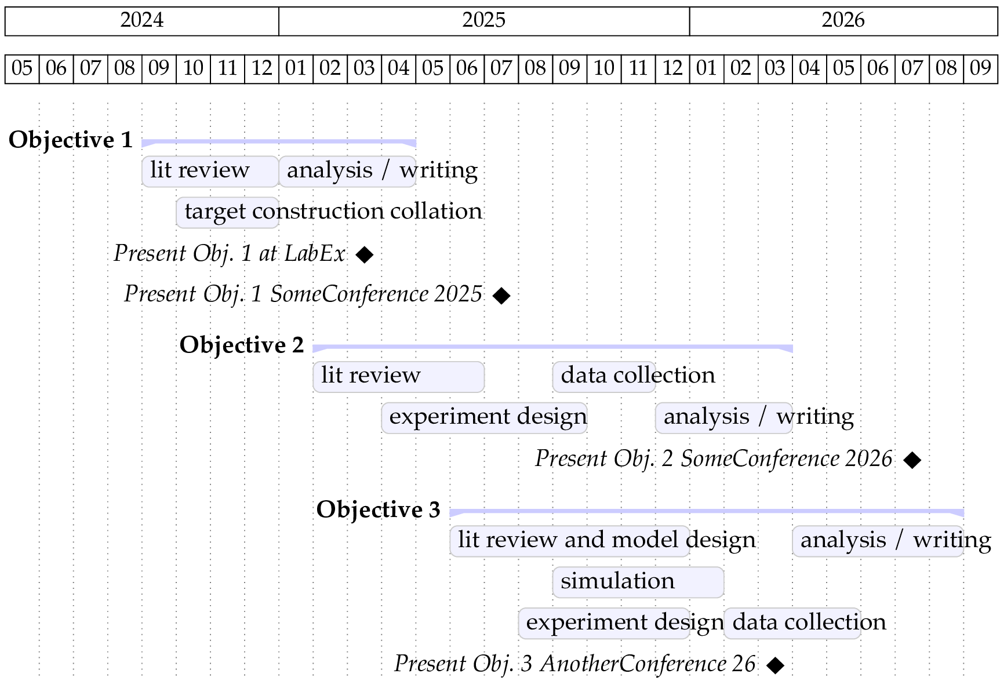

Make a gantt chart with LaTeX package [`pgfgantt`](https://ctan.org/pkg/pgfgantt), and export as png (via [ImageMagick](https://imagemagick.org/index.php) ^v7)

Edit `gantt.tex`, then run:

```sh
latexmk -xelatex gantt.tex
latexmk -c gantt.tex
```

to make `gantt.pdf` and convert it to `gantt.png` also


